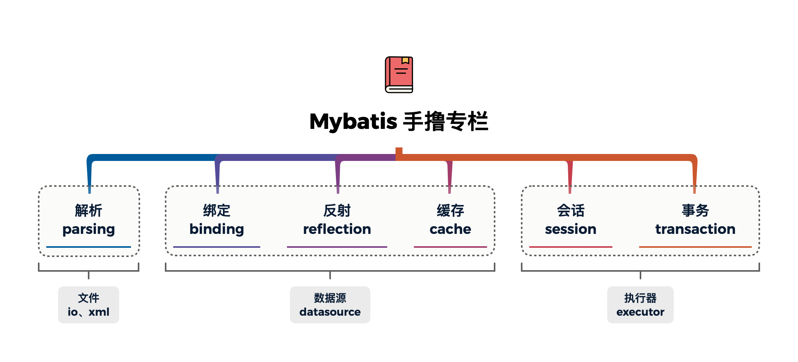
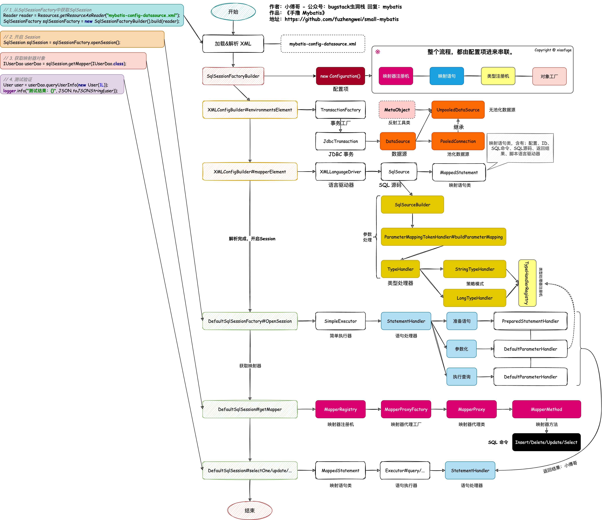
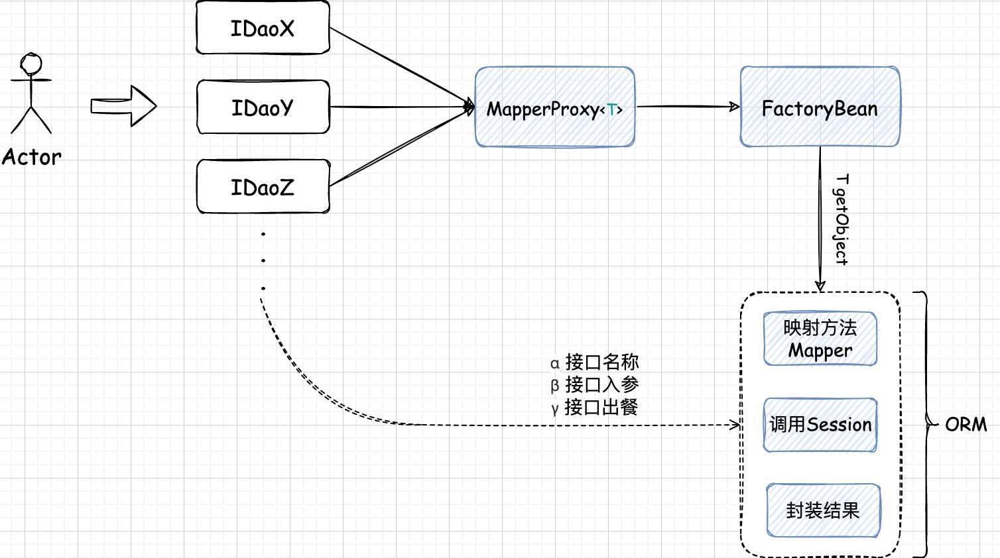

# Mybatis 学习

## 手写Mybatis

> [专栏地址](https://bugstack.cn/md/spring/develop-mybatis/2022-03-20-%E7%AC%AC1%E7%AB%A0%EF%BC%9A%E5%BC%80%E7%AF%87%E4%BB%8B%E7%BB%8D%EF%BC%8C%E6%89%8B%E5%86%99Mybatis%E8%83%BD%E7%BB%99%E4%BD%A0%E5%B8%A6%E6%9D%A5%E4%BB%80%E4%B9%88%EF%BC%9F.html)

### 目标

### 总览

### 核心原理

> “为什么在使用 Mybatis 的时候，只需定义一个接口，不用写实现类就能使用 XML 中或者注解上配置好的 SQL 语句，就能完成对数据库 CRUD 的操作呢？”

